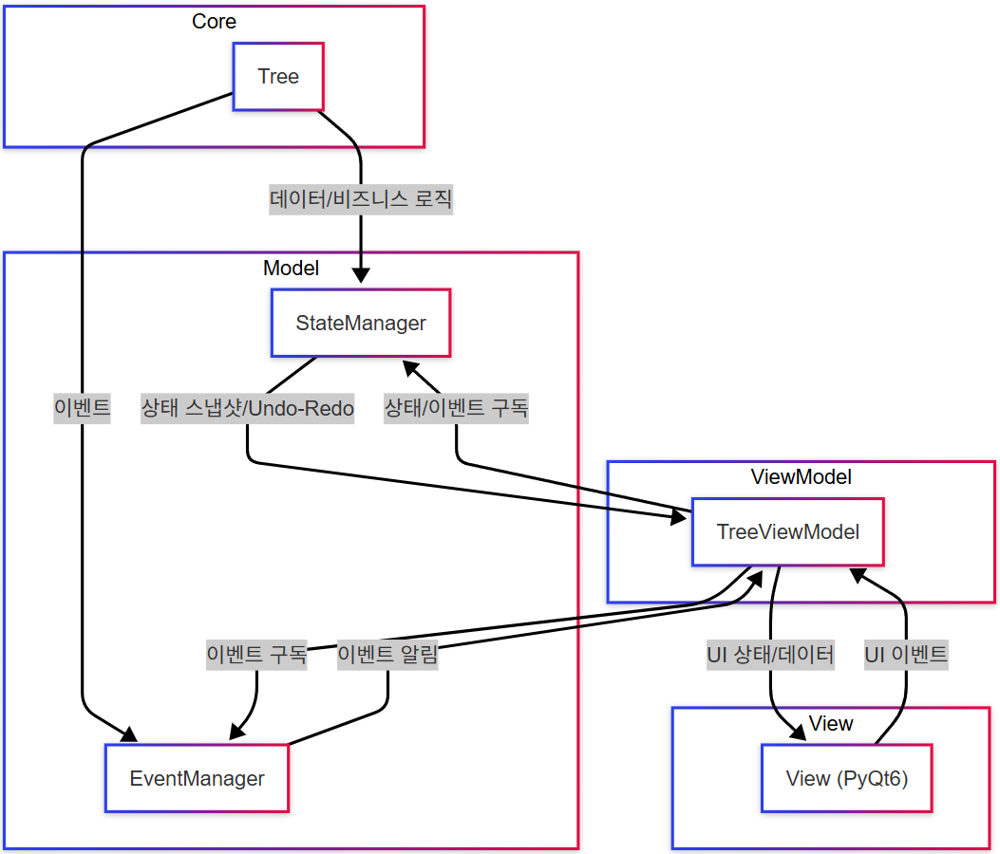

# Macro_Tree

> [!NOTE]
> 이 프로젝트는 현재 아키텍처 리팩토링 중입니다.  
> 코드와 문서가 최신 구조에 맞게 지속적으로 업데이트되고 있습니다.

트리 구조 기반 매크로 관리 보일러 플레이트 (기초 뼈대 프로그램) 프로젝트 입니다.

실무에서 3D AI 데이터 구축 프로젝트를 위해 매크로 프로그램을 개발하면서, 단발성 소프트웨어의 한계와 역량 내재화의 어려움을 경험했습니다. 이를 보완하고자 재사용성과 확장성을 갖춘 '보일러 플레이트' 프로젝트를 시작했습니다. 매크로 컨셉만 남기고 기본 트리 구조를 바탕으로 범용성,  유연성, 견고성에 중점을 두었습니다.

*다른 언어로 읽기: [English](README.md)*

---

## Demo

<table>
  <tr>
    <td align="center">
      <strong>Before (2023)</strong><br>
      
    </td>
    <td align="center">
      <strong>After (2025, 진행 중)</strong><br>
      
    </td>
  </tr>
</table>

---

## 프로젝트 연혁

| 항목명           | 2022 (실무)         | 2023 (이론/학습)         | 2025 (응용)      |
|------------------|---------------------|-----------------------|-----------------------|
| **개발 계기** | 실무 중 자발적 제작 | 개인 학습 프로젝트 | 범용 오픈소스 도구화 |
| **공개 여부** | 비공개 (팀 공유) | 공개 (GitHub) | 공개 (GitHub) |
| **사용 대상** | 팀원 | 일반 사용자 | 개발자 |
| **SW 목적**  | 3D AI 데이터 구축 자동화         | 학습용 프로토타입      | 오픈 소스 SW      |
| **주요 기능**     | 매크로 자동화       | 명령어 조립식 자동화    | 개발 보조      |
| **자료 구조**   | 단순/없음           | 트리 구조         | 트리 구조      |
| **프레임워크**| PyQt5               | PyQt6                 | PyQt6(+크로스 플랫폼)      |
| **UX/UI**    | 컴팩트    | 올인원       | 올인원      |

2022년 버전은 오픈소스만 활용하여 자발적으로 만든 팀 내부 도구입니다 (회사 코드/인프라 미사용)

---

## 적용 기술/품질 개선 현황

이 표는 Macro_Tree 프로젝트의 주요 설계/품질/자동화 요소가 2023년(초기)과 2025년(최종) 기준으로 어떻게 적용되었는지 요약합니다.

| 항목                | Before (2023) | After (2025) | 세부 내용 |
|---------------------|:-------------:|:------------:|:---------|
| 설계 원칙           | 🟡            | 🟢           | SOLID 원칙 (SRP, OCP, LSP, ISP, DIP) |
| 현대적 파이썬 활용  | ❌            | 🟢           | 타입 힌팅, Protocol/Interface, Data Class 등 |
| 디자인 패턴         | 🟡            | 🟢           | Observer, Repository, State, Singleton, Factory, Command, Adapter, Memento |
| 아키텍처 패턴       | ❌            | 🟢           | MVVM (Core-Model-ViewModel-Platforms(Adapter)-View) |
| 테스트/품질 관리    | ❌            | 🟢           | pytest, mypy, CI, flake8 |
| 문서화              | 🟡            | 🟢           | README, pdoc, 다이어그램 |
| AI 어시스턴스           | ❌            | 🟢           | Cursor |

---

## 주요 기능 구현 현황

| 기능            | Before (2023) | After (2025) | 세부 내용 |
|-----------------|:-------------:|:------------:|:---------|
| Tree       | 🟢            | 🟢           | 트리 노드 추가/삭제/이동 |
| Undo/Redo(Custom)| 🟢            | 🟢           | 상태 이력 관리 및 복원 |
| Action Data     | 🟢            | 🔄           | 입력 장치별 액션 |
| Save/Load       | 🟢            | 🔄           | 저장/로드 |
| Database        | ❌            | 🔄           | PostgreSQL |
| Grouping        | 🟢            | ❌           | 그룹/해제 |
| Checkbox        | 🟢            | ❌           | 체크 박스 연동 |
| Get Mouse Position | 🟢         | ❌           | 연속 마우스 좌표 획득 |
| Menu | 🟢         | ❌           | 메뉴바, 컨텍스트 메뉴 |

---

## 주요 기능

**구현 완료:**
- 트리 노드 이동, 삽입, 삭제
- Undo/Redo 기능
- 계층 구조 시각화 및 조작

**개발 중 / 예정:**
- 그룹화 및 인스턴스 생성
- 데이터 영속성 (저장 및 불러오기)
- 마우스 좌표 획득

---

## 프로젝트 현황

- ✅ **Core 모듈**: 완료 (인터페이스 설계 및 기본 구현)
- 🔄 **Model 계층**: Repository (File, DB) (진행 중); State, Event (대부분 완료)
- 🔄 **ViewModel / View**: 진행 중 (import 경로/네이밍/책임 분리/패턴 일관화)
- 🔄 **테스트/문서/자동화**: 진행 중 (CI, pytest, mypy, pdoc)

---

## 아키텍처

- **SOLID 원칙**: SRP, OCP, LSP, ISP, DIP
- **인터페이스 기반 설계**: Protocol을 활용한 명확한 계약 정의
- **계층화 아키텍처**: Core, Model, ViewModel, Platforms, View

## Architecture Diagram



### 계층 개요

- **core**: 핵심 비즈니스 로직, 인터페이스, 구현체
- **model**: 비즈니스 로직 확장 (저장소, 서비스, 상태, 이벤트)
- **viewmodel**: 뷰모델 계층 (상태 변환, UI 로직)
- **platforms**: 크로스 플랫폼 어댑터 (뷰모델과 뷰 사이, Adapter 패턴)
- **view**: 뷰 계층 (PyQt6/QML UI 컴포넌트)

<details>
<summary>Project Structure</summary>

```text
├── core/                     # 핵심 비즈니스 로직
│   ├── interfaces/           # 코어 인터페이스 (트리, 아이템, 데이터, 타입, 유틸, 키)
│   └── impl/                 # 코어 구현체 (트리, 아이템, 타입, 유틸)
│   └── exceptions.py         # 코어 예외
├── model/                    # 비즈니스 로직 확장 계층
│   ├── store/                # 데이터 영속성 관리 (repo, file, db)
│   ├── state/                # 상태 관리
│   ├── action/               # 액션 처리
│   ├── traversal/            # 트리 순회 로직
│   └── events/               # 이벤트 처리
├── viewmodel/                # 뷰모델 계층
│   ├── interfaces/           # 뷰모델 인터페이스
│   └── impl/                 # 뷰모델 구현체
│       ├── tree_viewmodel_core.py    # 뷰모델 코어 로직
│       ├── tree_viewmodel_model.py   # 모델 관련 뷰모델 로직
│       ├── tree_viewmodel_view.py    # 뷰 관련 뷰모델 로직
│       └── tree_viewmodel.py         # 메인 뷰모델 클래스
├── view/                     # 뷰/UI 계층
├── platforms/                # 플랫폼 특화 코드 (어댑터, 인터페이스)
├── debug/                    # 디버깅 도구 및 뷰어
├── tests/                    # 테스트 코드 (pytest)
├── main.py                   # 애플리케이션 진입점
├── requirements.txt          # 파이썬 의존성
├── README_KR.md              # 프로젝트 문서 (현재 파일)
└── README.md                 # 영문 프로젝트 문서
```

</details>

---

## 기술 스택

- **Backend**: Python 3.10
- **Frontend**: PyQt6
- **Data Management**: PostgreSQL, 파일 기반 저장소
- **Architecture**: MVVM 패턴, Protocol 기반 인터페이스
- **Automation**: PyAutoGUI, pynput

---

## 설계 원칙 및 패턴

- **Protocol-based Interfaces**: 구조적 타이핑 및 mypy를 통한 정적 타입 검사로 유연하고 신뢰성 있는 계약 정의.
- **MVVM Architecture**: UI와 비즈니스 로직의 명확한 분리, 독립적인 ViewModel 테스트 및 유지보수 용이성 확보.
- **Dependency Inversion**: 핵심 로직이 구체 구현이 아닌 추상화에 의존하여 확장성 및 모듈성 증대.
- **Observer Pattern**: 구독/알림(Qt 시그널/슬롯 포함)을 통한 느슨한 결합 기반의 상태 변경 알림으로 반응형 UI 업데이트 구현.
- **Repository Pattern**: 데이터 접근 계층 추상화로 DB, 파일 등 다양한 백엔드 저장소로 손쉬운 전환 가능.
- **State Pattern (Undo/Redo)**: StateManager가 상태 전환 및 이력을 캡슐화하여 ViewModel 로직 단순화.

---

## 개발 표준 및 품질 관리

- **Coding Style**: `CODING_STYLE.md`에 정의된 규칙 준수.
- **Static Type Checking**: `mypy`를 사용하여 코드베이스 전체의 타입 안정성 보장.
- **Unit Testing**: `pytest`를 활용한 자동화된 단위 테스트 (테스트 커버리지 지속 확장 중).
- **Linting & Import Sorting**: `flake8`(린팅) 및 `isort`(임포트 정렬, `setup.cfg`에 설정) 사용.
- **Continuous Integration**: GitHub Actions 등 CI 도구를 통해 PR/커밋 시 빌드, 테스트, 타입 검사 자동화.

---

## 설치 및 사용법

1. **Python 3.10 이상** 필요.
2. 의존성 설치:
   ```bash
   pip install -r requirements.txt
   ```
3. (선택) DB 영속성을 사용할 경우 PostgreSQL 설정.
4. 애플리케이션 실행:
   ```bash
   python main.py
   ```
5. 패키지된 실행파일 (Windows):
   - PyInstaller로 빌드:
     ```bash
     pyinstaller main.py --onefile --windowed --paths=src --add-data "src/images/icons;src/images/icons"
     ```
   - 실행파일은 `dist/` 폴더에 생성됨.

---

## 라이선스

이 프로젝트는 MIT 라이선스를 따릅니다 - 자세한 내용은 [LICENSE](LICENSE) 파일을 참조하세요. 