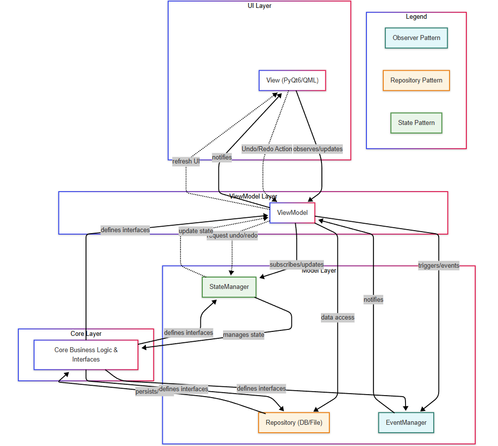

# Macro_Tree

> [!NOTE]
> 이 프로젝트는 현재 아키텍처 리팩토링 중입니다.  
> 코드와 문서가 최신 구조에 맞게 지속적으로 업데이트되고 있습니다.

트리 구조 기반 매크로 관리 애플리케이션입니다.  
실무 환경에서 생산성을 3배 향상시킨 자동화 프로그램에서 착안하여,  
보안 관련 요소를 제거하고 범용 컨셉으로 확장성과 유연성을 확보하였습니다.

*다른 언어로 읽기: [English](README.md)*

---

## 데모

<table>
  <tr>
    <td align="center">
      <strong>Before (2023, 레거시 코드)</strong><br>
      
    </td>
    <td align="center">
      <strong>After (2025, 리팩토링 코드, 진행중)</strong><br>
      
    </td>
  </tr>
</table>

---

## 적용 기술/품질 개선 현황

이 표는 Macro_Tree 프로젝트의 주요 설계/품질/자동화 요소가 2023년(초기)과 2025년(최종) 기준으로 어떻게 적용되었는지 요약합니다.

| 항목                | Before (2023) | After (2025) | 세부 내용 |
|---------------------|:-------------:|:------------:|:---------|
| 설계 원칙           | 🟡            | 🟢           | SOLID 원칙 (SRP, OCP, LSP, ISP, DIP) |
| 구현 기술/패러다임  | ❌            | 🟢           | 타입 힌팅, Protocol/Interface, Data Class 등 현대적 파이썬 기법 |
| 디자인 패턴         | 🟡            | 🟢           | Observer, Repository, State, Singleton, Factory, Command, Adapter, Memento |
| 아키텍처 패턴 (MVVM)| ❌            | 🟢           | |
| 테스트/품질 관리    | ❌            | 🟢           | pytest, mypy, CI, flake8 |
| 문서화              | 🟡            | 🟢           | README, pdoc, 다이어그램 |

---

## 주요 기능 구현 현황

| 기능            | Before (2023) | After (2025) | 세부 내용 |
|-----------------|:-------------:|:------------:|:---------|
| Tree       | 🟢            | 🟢           | 트리 노드 추가/삭제/이동 |
| Undo/Redo       | 🟢            | 🟢           | 상태 이력 관리 및 복원 |
| Action Data     | 🟢            | 🟡           | 입력 장치별 액션 |
| Save/Load       | 🟢            | 🟡           | 저장/로드 |
| Database        | ❌            | 🟡           | PostgreSQL |
| Grouping        | 🟢            | ❌           | 그룹/해제 |
| Checkbox        | 🟢            | ❌           | 체크 박스 연동 |
| Get Mouse Position | 🟢         | ❌           | 연속 마우스 좌표 획득 |

---

## 주요 기능

**구현 완료:**
- ✅ 트리 노드 이동, 삽입, 삭제
- ✅ Undo, Redo 기능
- ✅ 계층 구조 시각화 및 조작


**개발 중 / 예정:**
- 🔄 그룹화 및 인스턴스 생성
- 🔄 데이터 영속성 (저장 및 불러오기)
- 🔄 마우스 좌표 획득

---

## 프로젝트 상태

- ✅ **Core 모듈**: 완료 (인터페이스 설계 및 기본 구현)
- ✅ **Model 계층**: 완료 (저장소, 파일, DB, 상태관리)
- 🔄 **ViewModel / View**: 진행 중 (import 경로/네이밍/책임 분리/패턴 일관화)
- 🔄 **테스트/문서/자동화**: 진행 중 (CI, pytest, mypy, pdoc)

---

## 아키텍처 설계

- **SOLID 원칙**: SRP, OCP, LSP, ISP, DIP
- **인터페이스 기반 설계**: Protocol을 활용한 명확한 계약 정의
- **계층화 아키텍처**: Core, Model, ViewModel, Platforms, View

## 아키텍처 다이어그램



### 계층 구조

- **core/**: 핵심 비즈니스 로직, 인터페이스, 구현체
- **model/**: 비즈니스 로직 확장 (저장소, 서비스, 상태, 이벤트)
- **viewmodel/**: 뷰모델 계층 (상태 변환, UI 로직)
- **platforms/**: 크로스 플랫폼 어댑터 (뷰모델과 뷰 사이, Adapter 패턴)
- **view/**: 뷰 계층 (PyQt6/QML UI 컴포넌트)

<details>
<summary>프로젝트 구조</summary>

├── core/                     # 핵심 비즈니스 로직
│   ├── interfaces/           # 코어 인터페이스 (트리, 아이템, 데이터, 타입, 유틸, 키)
│   └── impl/                 # 코어 구현체 (트리, 아이템, 타입, 유틸)
│   └── exceptions.py         # 코어 예외
├── model/                    # 비즈니스 로직 확장 계층
│   ├── store/                # 데이터 영속성 관리 (repo, file, db)
│   ├── state/                # 상태 관리
│   ├── action/               # 액션 처리
│   ├── traversal/            # 트리 순회 로직
│   └── events/               # 이벤트 처리
├── viewmodel/                # 뷰모델 계층
│   ├── interfaces/           # 뷰모델 인터페이스
│   └── impl/                 # 뷰모델 구현체
│       ├── tree_viewmodel_core.py    # 뷰모델 코어 로직
│       ├── tree_viewmodel_model.py   # 모델 관련 뷰모델 로직
│       ├── tree_viewmodel_view.py    # 뷰 관련 뷰모델 로직
│       └── tree_viewmodel.py         # 메인 뷰모델 클래스
├── view/                     # 뷰/UI 계층
├── platforms/                # 플랫폼 특화 코드 (어댑터, 인터페이스)
├── debug/                    # 디버깅 도구 및 뷰어
├── tests/                    # 테스트 코드 (pytest)
├── main.py                   # 애플리케이션 진입점
├── requirements.txt          # 파이썬 의존성
├── README_KR.md              # 프로젝트 문서
└── ...
</details>

## 인터페이스 구조
- **코어 인터페이스:** 트리 및 아이템 컴포넌트의 기본 인터페이스
- **모델 인터페이스:** 비즈니스 로직 인터페이스 (저장소, 상태 관리자)
- **구현 클래스:** 인터페이스의 구체적인 구현체
- **TreeStateManager:** 트리 상태 추적 및 관리
- **TreeRepository:** 데이터 영속성 작업
- **MTTreeViewModel:** 트리 데이터를 위한 표현 로직
- **TreeView:** 사용자 인터페이스 컴포넌트

## 요구사항
- Python 3.10 이상
- PostgreSQL (데이터 영속성)
- Windows 운영체제

## 라이선스
이 프로젝트는 MIT 라이선스를 따릅니다 - 자세한 내용은 [LICENSE](LICENSE) 파일을 참조하세요.

## 데모 영상

(과거 레거시 코드 기반의 데모 영상입니다)

- **백엔드**: Python 3.10
- **프론트엔드**: PyQt6, QML
- **데이터 관리**: PostgreSQL, 파일 기반 저장소
- **아키텍처**: MVVM 패턴, Protocol 기반 인터페이스
- **자동화**: PyAutoGUI, pynput

## 설계 원칙 및 패턴

### 인터페이스 기반 설계(Protocol 기반)
- **구조적 타이핑**: 명시적 상속 없이도 인터페이스 준수
- **정적 타입 검사 지원**: mypy를 통한 안정성 강화

### MVVM 아키텍처 패턴
- **관심사 분리**: UI와 비즈니스 로직 분리
- **테스트 용이성**: ViewModel 단위 독립 테스트 가능

### 의존성 역전 원칙
- **상위 정책 보호**: Core 모듈이 구체 구현에 의존하지 않음
- **확장성 강화**: 신규 기능 추가 시 코드 변경 최소화

### 옵저버 패턴(상태 변화 알림)
- **결합도 최소화**: ViewModel, StateManager, EventManager 등에서 구독/알림(Observer) 구조를 사용하여, 직접적인 결합 없이 상태 변화를 통지합니다. 특히 ViewModel은 Qt의 시그널/슬롯 메커니즘(예: `pyqtSignal`)을 활용하여 View에게 상태 변경을  알림으로써, View가 ViewModel의 내부 구현을 몰라도 업데이트 되도록 합니다다.
- **반응형 UI**: 데이터가 변경될 때마다 구독자(예: UI View)가 자동으로 갱신되어, 반응형 인터페이스 구현이 가능합니다.

### 저장소(Repository) 패턴(데이터 접근 추상화)
- **영속성 계층 분리**: 트리 데이터의 저장/불러오기 등 데이터 접근 로직(DB, 파일 등)을 비즈니스 로직과 분리하여, 저장소 인터페이스를 통해 추상화
- **유연한 확장성**: 다양한 저장 방식(PostgreSQL, 파일 등)으로 손쉽게 확장 및 교체 가능

### 상태(State) 패턴(Undo/Redo 관리)
- **상태 전이 캡슐화**: 트리의 상태 이력을 StateManager가 관리하며, Undo/Redo 기능 제공
- **단순한 ViewModel**: ViewModel은 상태 관리(이력, 복원 등)를 StateManager에 위임하여, 코드가 단순해짐

## 코드 품질 및 표준

- **코딩 스타일 가이드**: 일관성을 위해 `CODING_STYLE.md`에 정의된 코딩 스타일을 따릅니다.
- **린터 및 포매터**: 코드 품질 유지를 위해 `flake8`(린터)와 `isort`(임포트 정렬, `setup.cfg`에 설정)을 사용합니다.
- **정적 타입 검사**: 코드 신뢰성과 유지보수성을 높이기 위해 타입 힌트를 적극적으로 사용하며, `mypy`(`mypy.ini`에 설정)로 정적 타입 검사를 수행합니다. 

## 설계 원칙 및 패턴

### 인터페이스 기반 설계(Protocol 기반)
- **구조적 타이핑**: 명시적 상속 없이도 인터페이스 준수
- **정적 타입 검사 지원**: mypy를 통한 안정성 강화

### MVVM 아키텍처 패턴
- **관심사 분리**: UI와 비즈니스 로직 분리
- **테스트 용이성**: ViewModel 단위 독립 테스트 가능

### 의존성 역전 원칙
- **상위 정책 보호**: Core 모듈이 구체 구현에 의존하지 않음
- **확장성 강화**: 신규 기능 추가 시 코드 변경 최소화

### 옵저버 패턴(상태 변화 알림)
- **결합도 최소화**: ViewModel, StateManager, EventManager 등에서 구독/알림(Observer) 구조를 사용하여, 직접적인 결합 없이 상태 변화를 통지합니다. 특히 ViewModel은 Qt의 시그널/슬롯 메커니즘(예: `pyqtSignal`)을 활용하여 View에게 상태 변경을  알림으로써, View가 ViewModel의 내부 구현을 몰라도 업데이트 되도록 합니다다.
- **반응형 UI**: 데이터가 변경될 때마다 구독자(예: UI View)가 자동으로 갱신되어, 반응형 인터페이스 구현이 가능합니다.

### 저장소(Repository) 패턴(데이터 접근 추상화)
- **영속성 계층 분리**: 트리 데이터의 저장/불러오기 등 데이터 접근 로직(DB, 파일 등)을 비즈니스 로직과 분리하여, 저장소 인터페이스를 통해 추상화
- **유연한 확장성**: 다양한 저장 방식(PostgreSQL, 파일 등)으로 손쉽게 확장 및 교체 가능

### 상태(State) 패턴(Undo/Redo 관리)
- **상태 전이 캡슐화**: 트리의 상태 이력을 StateManager가 관리하며, Undo/Redo 기능 제공
- **단순한 ViewModel**: ViewModel은 상태 관리(이력, 복원 등)를 StateManager에 위임하여, 코드가 단순해짐

## 코드 품질 및 표준

- **코딩 스타일 가이드**: `CODING_STYLE.md`의 규칙을 따릅니다.
- **린터 및 포매터**: `flake8`(린트), `isort`(import 정렬, `setup.cfg`에 설정)
- **정적 타입 검사**: `mypy`로 전체 코드 타입 안정성 검증
- **단위 테스트**: `pytest` 기반 자동화 테스트 (커버리지 확대 중)
- **코드 린트/정렬**: `flake8`(린트), `isort`(import 정렬, `setup.cfg`에 설정)
- **CI 연동**: GitHub Actions 등으로 PR/커밋 시 자동 빌드/테스트/타입체크 수행

---

## 설계 원칙 및 패턴

### 인터페이스 기반 설계(Protocol 기반)
- **구조적 타이핑**: 명시적 상속 없이도 인터페이스 준수
- **정적 타입 검사 지원**: mypy를 통한 안정성 강화

### MVVM 아키텍처 패턴
- **관심사 분리**: UI와 비즈니스 로직 분리
- **테스트 용이성**: ViewModel 단위 독립 테스트 가능

### 의존성 역전 원칙
- **상위 정책 보호**: Core 모듈이 구체 구현에 의존하지 않음
- **확장성 강화**: 신규 기능 추가 시 코드 변경 최소화

### 옵저버 패턴(상태 변화 알림)
- **결합도 최소화**: ViewModel, StateManager, EventManager 등에서 구독/알림(Observer) 구조를 사용하여, 직접적인 결합 없이 상태 변화를 통지합니다. 특히 ViewModel은 Qt의 시그널/슬롯 메커니즘(예: `pyqtSignal`)을 활용하여 View에게 상태 변경을  알림으로써, View가 ViewModel의 내부 구현을 몰라도 업데이트 되도록 합니다다.
- **반응형 UI**: 데이터가 변경될 때마다 구독자(예: UI View)가 자동으로 갱신되어, 반응형 인터페이스 구현이 가능합니다.

### 저장소(Repository) 패턴(데이터 접근 추상화)
- **영속성 계층 분리**: 트리 데이터의 저장/불러오기 등 데이터 접근 로직(DB, 파일 등)을 비즈니스 로직과 분리하여, 저장소 인터페이스를 통해 추상화
- **유연한 확장성**: 다양한 저장 방식(PostgreSQL, 파일 등)으로 손쉽게 확장 및 교체 가능

### 상태(State) 패턴(Undo/Redo 관리)
- **상태 전이 캡슐화**: 트리의 상태 이력을 StateManager가 관리하며, Undo/Redo 기능 제공
- **단순한 ViewModel**: ViewModel은 상태 관리(이력, 복원 등)를 StateManager에 위임하여, 코드가 단순해짐

## 코드 품질 및 표준

- **코딩 스타일 가이드**: `CODING_STYLE.md`의 규칙을 따릅니다.
- **린터 및 포매터**: `flake8`(린트), `isort`(import 정렬, `setup.cfg`에 설정)
- **정적 타입 검사**: `mypy`로 전체 코드 타입 안정성 검증
- **단위 테스트**: `pytest` 기반 자동화 테스트 (커버리지 확대 중)
- **코드 린트/정렬**: `flake8`(린트), `isort`(import 정렬, `setup.cfg`에 설정)
- **CI 연동**: GitHub Actions 등으로 PR/커밋 시 자동 빌드/테스트/타입체크 수행

---

## 설계 원칙 및 패턴

### 인터페이스 기반 설계(Protocol 기반)
- **구조적 타이핑**: 명시적 상속 없이도 인터페이스 준수
- **정적 타입 검사 지원**: mypy를 통한 안정성 강화

### MVVM 아키텍처 패턴
- **관심사 분리**: UI와 비즈니스 로직 분리
- **테스트 용이성**: ViewModel 단위 독립 테스트 가능

### 의존성 역전 원칙
- **상위 정책 보호**: Core 모듈이 구체 구현에 의존하지 않음
- **확장성 강화**: 신규 기능 추가 시 코드 변경 최소화

### 옵저버 패턴(상태 변화 알림)
- **결합도 최소화**: ViewModel, StateManager, EventManager 등에서 구독/알림(Observer) 구조를 사용하여, 직접적인 결합 없이 상태 변화를 통지합니다. 특히 ViewModel은 Qt의 시그널/슬롯 메커니즘(예: `pyqtSignal`)을 활용하여 View에게 상태 변경을  알림으로써, View가 ViewModel의 내부 구현을 몰라도 업데이트 되도록 합니다다.
- **반응형 UI**: 데이터가 변경될 때마다 구독자(예: UI View)가 자동으로 갱신되어, 반응형 인터페이스 구현이 가능합니다.

### 저장소(Repository) 패턴(데이터 접근 추상화)
- **영속성 계층 분리**: 트리 데이터의 저장/불러오기 등 데이터 접근 로직(DB, 파일 등)을 비즈니스 로직과 분리하여, 저장소 인터페이스를 통해 추상화
- **유연한 확장성**: 다양한 저장 방식(PostgreSQL, 파일 등)으로 손쉽게 확장 및 교체 가능

### 상태(State) 패턴(Undo/Redo 관리)
- **상태 전이 캡슐화**: 트리의 상태 이력을 StateManager가 관리하며, Undo/Redo 기능 제공
- **단순한 ViewModel**: ViewModel은 상태 관리(이력, 복원 등)를 StateManager에 위임하여, 코드가 단순해짐

## 코드 품질 및 표준

- **코딩 스타일 가이드**: `CODING_STYLE.md`의 규칙을 따릅니다.
- **정적 타입 검사**: `mypy`로 전체 코드 타입 안정성 검증
- **단위 테스트**: `pytest` 기반 자동화 테스트 (커버리지 확대 중)
- **코드 린트/정렬**: `flake8`(린트), `isort`(import 정렬, `setup.cfg`에 설정)
- **CI 연동**: GitHub Actions 등으로 PR/커밋 시 자동 빌드/테스트/타입체크 수행

---

## 설치 및 실행 방법

1. **Python 3.10 이상** 필요
2. 의존성 설치:
   ```bash
   pip install -r requirements.txt
   ```
3. (선택) DB 영속성을 사용할 경우 PostgreSQL 세팅
4. 애플리케이션 실행:
   ```bash
   python main.py
   ```
5. 실행파일(Windows)로 배포 시:
   - PyInstaller로 빌드:
     ```bash
     pyinstaller main.py --onefile --windowed --paths=src --add-data "src/images/icons;src/images/icons"
     ```
   - 실행파일은 `dist/` 폴더에 생성됨

---

## 라이선스

이 프로젝트는 MIT 라이선스를 따릅니다 - 자세한 내용은 [LICENSE](LICENSE) 파일을 참조하세요. 